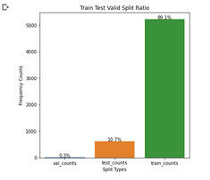
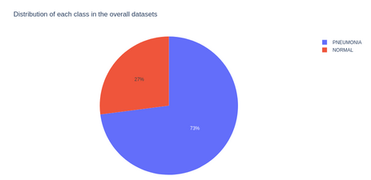
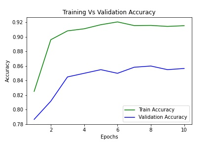
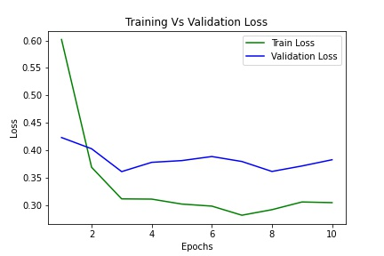

# Diagnosis Of Pneumonia From X-ray Images

We have seen tremendous research going on in medical imaging by utilizing available medical CT scan images and xray images.
On November 15, 2017, Stanford researchers have developed an algorithm that offers diagnoses based on chest X-ray images.
It can diagnose up to 14 types of medical conditions and is able to diagnose pneumonia better than expert radiologists working alone.
Thus, it is possible to use Deep Learning algorithms to detect the disease from images of Chest X-rays and CT scans.
Automated applications can be created to help support radiologists.
So,this project aims to detect pneumonia cases from the x-ray images.
This project will be an end to end solution where the user/radiologist will upload the chest x-ray image to the app and the app would return the predictions denoting whether the patient has pneumonia or not.

**Problem Statement**

<li>According to the latest WHO data published in 2018 Influenza and Pneumonia Deaths in Nepal reached 9,712 or 5.83% of total deaths.</li>
<li>Chest pain, Difficulty in breathing, Respiratory problems - Symptoms of Pneumonia</li>
<li>All these respiratory symptoms can be identified by the radiologist by observing the chest x-ray images of the patient.</li>

**Aims & Objectives**
<li> So, the objective of the project is to create a deep learning algorithm to identify pneumonia patients by interpreting chest x-ray images.</li>
<li>This project will be an end to end solution where the user/radiologist will upload the chest x-ray image to the app and the app would return the predictions denoting whether the patient has pneumonia or not.</li>

**Data**
<li>There are a total of 5856 image datasets.</li>
<li>Anterior-posterior Chest X-ray images were selected from the patients of one to five years old from Guangzhou Women and Children’s Medical Center, Guangzhou.</li>
<li>The overall image datasets are categorized into two main classes : 'NORMAL' and 'PNEUMONIA'.</li>
<li>The overall dataset is divided into three different splits : training, testing and validation.</li>

**Train Test Split Ratio**

**Distribution Of Each Class In the Overall Dataset**

**Training Vs Validation Accuracy**

**Training Vs Validation Loss**

